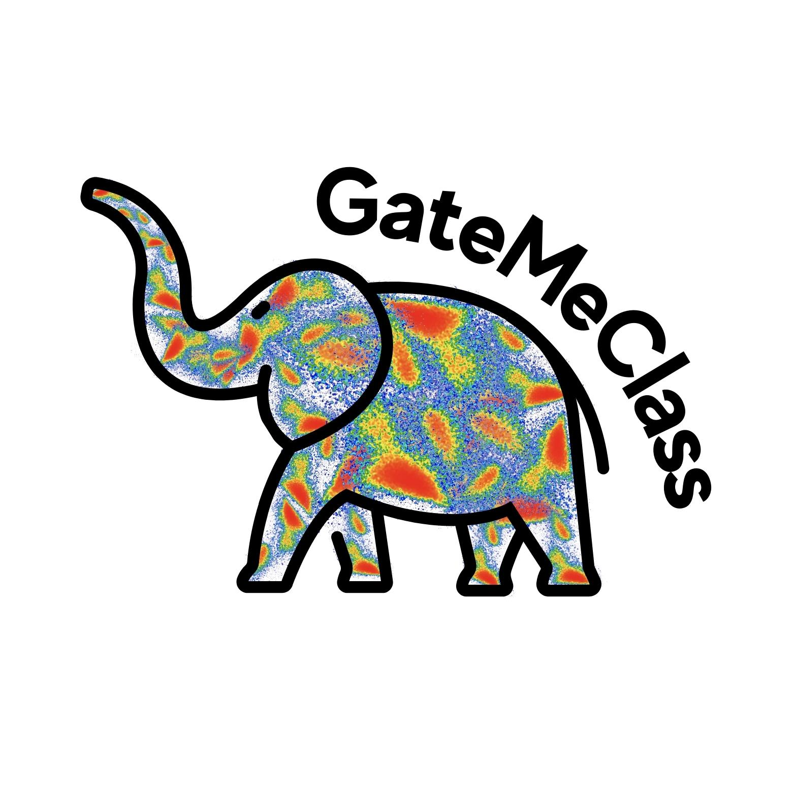

# GateMeClass: Gate Mining and Classification of cytometry data

GateMeClass (Gate Mining and Classification), developed using the R programming language, is an intuitive tool that simplifies the cell annotation process.
It enables both supervised and semi-supervised classification of cytometry data, with a strong emphasis on preserving a high degree of biological interpretability through the use of the marker table. By leveraging the marker table, GateMeClass effectively conducts cytometry data classification, providing precise and informative outcomes.

For every technical detail, we invite you to refer to the complete article regarding GateMeClass at the provided link: [LINK]

Tutorial: 

To ensure a comprehensive understanding of GateMeClass, we recommend providing a tutorial guide for its complete usage at the *tutorial* branch folder.

  

